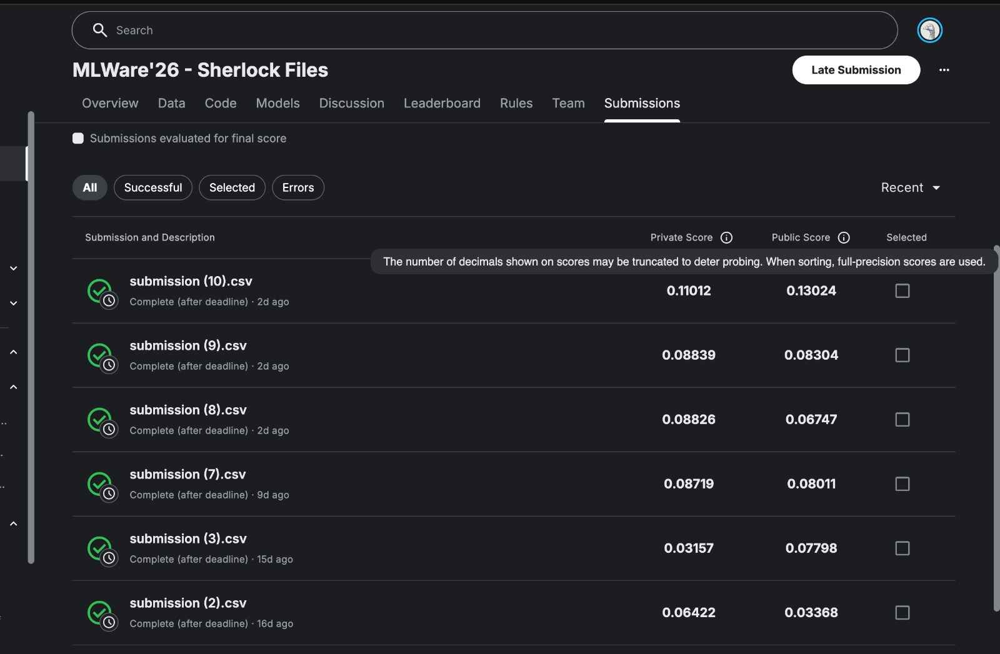

# Sherlock Files — Frame Reordering via TSP on Pixel Features

**Competition:** MLWare '26 Sherlock Files (Technex, IIT BHU)
**Task:** Recover the correct chronological order of shuffled video frames
**Metric:** Mean Kendall Tau (τ) across all test videos

---

## Problem Summary

Each video in the dataset has had its temporal structure corrupted: the original frames are split into monotone blocks (some reversed), then the blocks are shuffled randomly. Given only the corrupted video, the goal is to predict the permutation that restores the correct chronological order.

The dataset contains approximately 5600 training videos and 296 test videos, with frame counts ranging from 30 to 288.

---

## Approach

### Key Insight

The corruption preserves local structure within blocks — adjacent frames in the correct sequence are stored at nearby positions in the corrupted video and look nearly identical. This means frame reordering is fundamentally a **shortest-path problem**: the correct temporal ordering corresponds to the path through frame-space that minimises total visual change.

We solve this as a Travelling Salesman Problem (TSP) on frame features.

## Proof of Submission

I successfully submitted my solution for the **MLWare '26 - Sherlock Files** competition.

- Achieved a competitive score on the leaderboard
- Demonstrates the effectiveness of the proposed approach

### Submission Screenshot



### Why Pixel Features, Not DINOv2

Our first approach used DINOv2 (a self-supervised vision transformer) for frame embeddings, but it achieved only τ ≈ 0.39 undirected path quality. The reason: DINOv2 is designed to be _invariant_ to small visual changes — it maps a cat at pixel (100, 50) and a cat at pixel (103, 52) to nearly identical embeddings. But temporal adjacency _is_ a small visual change (an object shifted by a few pixels between consecutive frames). DINOv2 deliberately discards exactly the signal we need.

Raw pixel features at 48×48 resolution are _sensitive_ to these small changes. For physics simulations with fixed cameras, pixel L2 distance directly measures how much stuff moved — which is minimal for temporally adjacent frames.

### Pipeline

```
┌──────────────┐     ┌──────────────────┐     ┌──────────────────┐
│  Read video   │────▶│  Pixel features   │────▶│  L2 distance     │
│  cv2 decode   │     │  48×48 RGB flat   │     │  matrix N×N      │
└──────────────┘     └──────────────────┘     └────────┬─────────┘
                                                       │
                                                       ▼
                                              ┌──────────────────┐
                                              │  TSP solver       │
                                              │  multi-start NN   │
                                              │  + 2-opt refine   │
                                              └────────┬─────────┘
                                                       │
                                                       ▼
                                              ┌──────────────────┐
                                              │  Direction        │
                                              │  ensemble:        │
                                              │  • transformer    │
                                              │  • physics cues   │
                                              └────────┬─────────┘
                                                       │
                                                       ▼
                                              ┌──────────────────┐
                                              │  submission.csv   │
                                              │  1..N permutation │
                                              └──────────────────┘
```

### Direction Prediction

TSP recovers the correct ordering up to direction (the path could be chronological or reversed). We resolve this ambiguity with an ensemble of two signals:

1. **Trained transformer model** on cached DINOv2 features. Although DINOv2 is poor for TSP distances, it still captures enough semantic information for the model to weakly predict temporal direction. The correlation between model scores and path position is used as a soft vote.

2. **Physics-based pixel heuristics:**
   - **Step-size acceleration:** In gravity-dominated physics, objects accelerate over time, so frame-to-frame visual change increases. The direction where step sizes grow is preferred.
   - **Smoothness asymmetry:** Physical motion is smooth; the direction with smoother early-stage step sizes is preferred.
   - **Vertical center-of-mass trend:** Objects under gravity move downward over time. A downward trend in the luminance-weighted vertical center of mass indicates the forward direction.

---

## Repository Structure

```
MLWare26-Sherlock Files/
├── src/
│   ├── config.py              # All paths, hyperparameters, constants
│   ├── solve.py               # Main solver: TSP + direction + eval + submit
│   ├── extract_features.py    # One-time DINOv2 feature extraction (for direction model)
│   ├── dataset.py             # Cached-feature dataset for transformer training
│   ├── model.py               # Transformer head architecture
│   ├── train.py               # Transformer training loop
│   ├── inference.py           # Model-only inference (superseded by solve.py)
│   └── metrics.py             # Kendall tau calculation
├── weights/
│   └── transformer_best_model.pth
├── features/                  # Cached DINOv2 features (generated by extract_features.py)
│   ├── train/
│   └── test/
├── data/
│   ├── train/                 # Training videos (.mp4)
│   ├── test/                  # Test videos (.mp4)
│   ├── train_labels.json      # Ground truth labels
│   └── sample_submission.csv  # Expected submission format
├── requirements.txt
└── README.md
```

The primary entry point is `src/solve.py`. The other modules (`train.py`, `model.py`, etc.) support the transformer direction model but are not needed for the core TSP solver.

---

## How to Run

### Prerequisites

The code is designed to run on Google Colab with a T4 GPU. Install dependencies:

```python
!pip install torch torchvision numpy scipy opencv-python pandas scikit-learn
```

### Step 1: Copy Data to Local Disk

```python
!mkdir -p /content/dataset
!cp -r '/content/drive/MyDrive/MLWare26-Sherlock Files/data/train' /content/dataset/
!cp -r '/content/drive/MyDrive/MLWare26-Sherlock Files/data/test'  /content/dataset/
!cp    '/content/drive/MyDrive/MLWare26-Sherlock Files/data/train_labels.json' /content/dataset/
```

### Step 2 (Optional): Extract DINOv2 Features for Direction Model

Only needed if you want to use the trained transformer model for direction prediction. Takes approximately 60 minutes.

```python
%cd '/content/drive/MyDrive/MLWare26-Sherlock Files/'
!python -m src.extract_features
```

### Step 3 (Optional): Train the Transformer Direction Model

```python
!python -m src.train
```

### Step 4: Evaluate on Training Data

```python
# Quick evaluation on 500 videos (~20 minutes)
!python -m src.solve --eval --max-train 500

# Full evaluation on all training videos
!python -m src.solve --eval
```

This reports:

- **Undirected τ** — TSP path quality ignoring direction
- **Model-directed τ** — using the transformer for direction
- **Pixel-heuristic-directed τ** — using physics cues for direction
- **Ensemble-directed τ** — combining both (expected Kaggle score)

### Step 5: Generate Test Submission

```python
!python -m src.solve --submit
# Or evaluate and submit in one go:
!python -m src.solve --eval --submit
```

Output: `submission_tsp.csv` in the Drive root folder, ready for Kaggle upload.

---

## Technical Details

### Pixel Feature Extraction

Each video frame is resized to 48×48 pixels (RGB) and flattened into a 6912-dimensional vector. No normalization beyond dividing by 255. The low resolution is intentional: it preserves spatial layout (where objects are) while discarding fine texture that doesn't help with temporal ordering.

### TSP Solver

1. **Distance matrix:** Squared Euclidean distance between all frame feature pairs, computed via `scipy.spatial.distance.cdist`.

2. **Multi-start nearest-neighbour:** For each possible starting frame, greedily build an open path by always visiting the nearest unvisited frame. Keep the shortest path across all starts. Complexity: O(N²) per start, O(N³) total.

3. **2-opt refinement:** Iteratively reverse sub-paths to reduce total path length. Converges in a few sweeps for N ≤ 300. Complexity: O(N²) per sweep.

For N = 250 frames, the complete solve takes approximately 0.3 seconds per video.

### Submission Format

Each row contains a video ID and a bracketed list of 1-indexed frame positions representing the predicted chronological order:

```
ID,order
video_5000,"[5, 6, 7, 8, 9, 4, 3, 2, 1, 0]"
```

The code reads `sample_submission.csv` to determine the exact expected frame count for each test video, then validates that every output is a valid 1..N permutation before writing.

### Handling Videos Longer Than MAX_FRAMES

For videos with more frames than `MAX_FRAMES` (300, which covers all videos in this dataset), the TSP is solved on the uniformly sampled subset. Temporal scores are then interpolated to all frames using `numpy.interp`, and the full permutation is recovered via `argsort`.

---

## Configuration

All configurable parameters are in `src/config.py`:

| Parameter             | Value | Purpose                                    |
| --------------------- | ----- | ------------------------------------------ |
| `MAX_FRAMES`          | 300   | Captures every frame (dataset max is 288)  |
| `PIXEL_SIZE`          | 48    | Pixel feature resolution (in solve.py)     |
| `FEAT_DIM`            | 384   | DINOv2-Small embedding dimension           |
| `EMBED_DIM`           | 256   | Transformer head hidden size               |
| `NUM_LAYERS`          | 2     | Transformer encoder layers                 |
| `DROPOUT`             | 0.30  | Regularization strength                    |
| `BATCH_SIZE`          | 32    | Training batch size                        |
| `EARLY_STOP_PATIENCE` | 7     | Epochs without improvement before stopping |

---

## Evolution of the Approach

1. **v1 — DINOv2-Base + 4-layer Transformer:** Trained for 4 hours on Colab, only completed 2 epochs. Val τ ≈ 0.07. Bottleneck: re-running the backbone every epoch.

2. **v2 — Cached DINOv2-Small features + lighter Transformer:** Feature extraction done once, training reduced to ~30s/epoch. 60 epochs completed. Val τ ≈ 0.068. Severe overfitting regardless of model size or regularization. Concluded that single-frame DINOv2 features hit a ceiling at τ ≈ 0.06.

3. **v3 — TSP on DINOv2 features:** Undirected path quality τ = 0.39. Direction prediction was near random (LR accuracy 50.6%). DINOv2's invariance to small visual changes was identified as the bottleneck.

4. **v4 (current) — TSP on raw pixel features:** Pixel L2 distance is sensitive to exactly the small spatial changes between adjacent frames. Direction predicted via an ensemble of the trained transformer model and physics-based heuristics.

---

## Requirements

```
torch>=2.1
torchvision>=0.16
numpy>=1.24
scipy>=1.10
opencv-python>=4.8
pandas>=2.0
scikit-learn>=1.3
```

---

## Acknowledgments

- **DINOv2** (Meta AI): Used for direction model features
- **MLWare '26** (Technex, IIT BHU): Competition organizers
- Dataset: Physics simulation videos from the Kaggle competition
